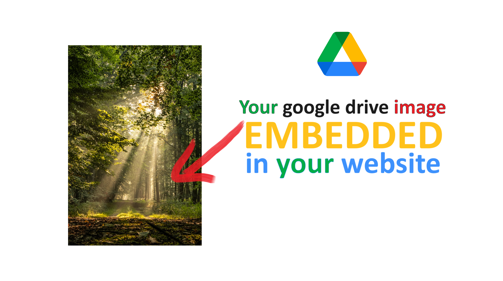
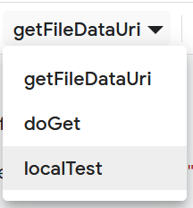
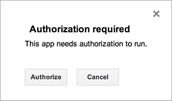
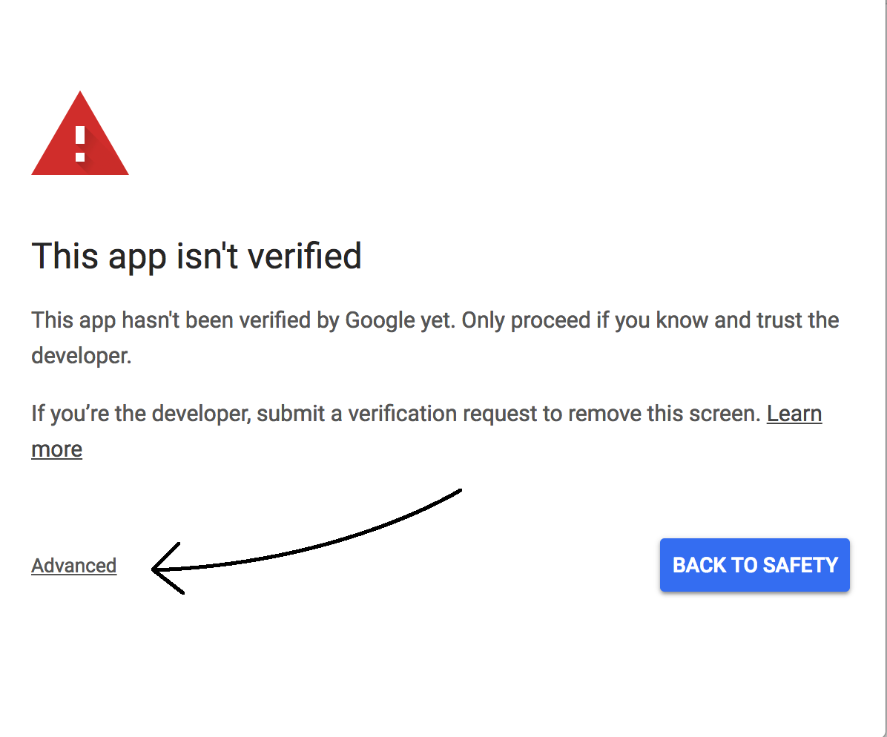
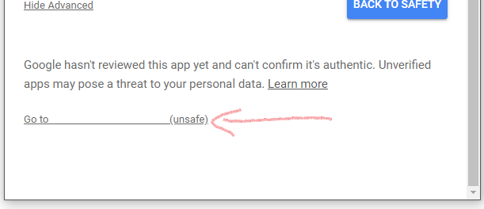
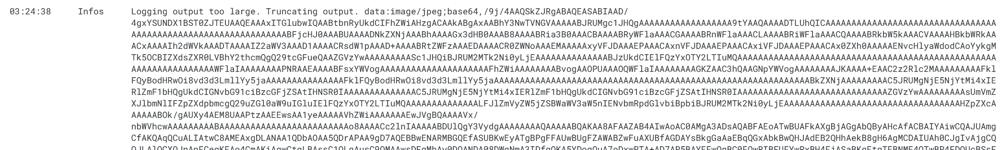
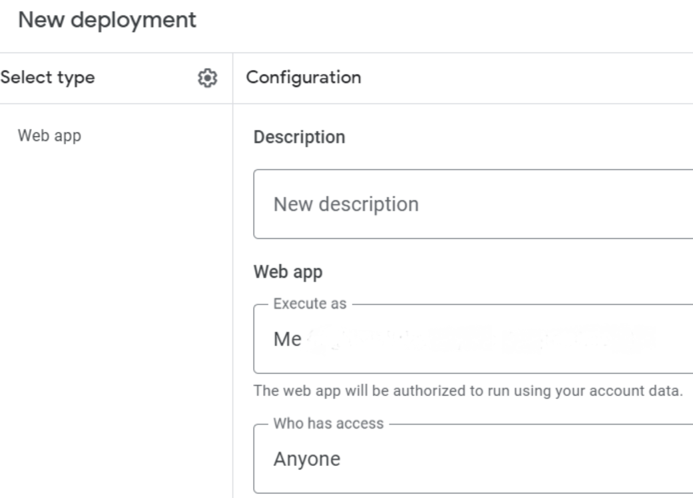

* TOC
{:toc}

# Motivation
Lately, Google made unexpected updates on embedding files from Google Drive. The images you embedded in your website are not working anymore ? This article will solve it in two possible ways, and I will explain them step by step.

> Note that both methods work on March 2024.

# What is google drive
Before we dive in, let's have some context ! According to [wikipedia](https://en.wikipedia.org/wiki/Google_Drive){:target="_blank"} :
> **Google Drive** is a **file storage** and **synchronization service** developed by Google. Launched on April 24, 2012, Google Drive allows users to store files in the cloud (on Google's servers), synchronize files across devices, and share files.

The most amazing part of it ? [It's totally free up to 15Gb](https://one.google.com/about/plans?g1_landing_page=0){:target="_blank"} !   
You can store as many files as you want, no matter what the file format is : pdf, excel, video, audio, ... or **images**. You got it, **we will focus on images in this article**.

# What is embedding
Embedding means displaying a ressource from a website into another website. Both websites can be hosted on the same domain, or on different ones. 
The embedded content can be :
- any media : image, video, audio, ...
- any html code block thanks to [iframes](https://developer.mozilla.org/en-US/docs/Web/HTML/Element/iframe){:target="_blank"} : tweets, instagram posts, youtube video, ...

# Image reference
For the rest of the article, I will use this [publicly shared image from my google drive](https://drive.google.com/file/d/1IIIq6BgH2y9l4GdkVQ-ApTo7dZm4bzVW/view?usp=sharing){:target="_blank"} to show up the final results of each method.   
Note that the access URL **https://drive.google.com/file/d/1IIIq6BgH2y9l4GdkVQ-ApTo7dZm4bzVW/view?usp=sharing** contains `1IIIq6BgH2y9l4GdkVQ-ApTo7dZm4bzVW`. This value is the file ID from google drive, aka `FILEID`. Go get yours in order to test both methods of this article later on.

# Old ways to embed that don't work anymore in 2024
## Preview
- `https://drive.google.com/file/d/FILEID/preview`   

- `https://drive.google.com/uc?export=preview&id=FILEID`   

## Direct link
- `https://drive.google.com/uc?export=view&id=FILEID`   

## User content
- `https://drive.usercontent.google.com/download?id=FILEID&export=preview`   

## Download
- `https://drive.google.com/uc?export=download&id=FILEID`   

# 1. First solution : thumbnail link
Use this link and replace `FILEID` with the right value of yours : `https://drive.google.com/thumbnail?id=FILEID&sz=s4000`

## Result
The image source down below is **https://drive.google.com/thumbnail?id=1IIIq6BgH2y9l4GdkVQ-ApTo7dZm4bzVW&sz=s4000**
 

## Explanation
- `Thumbnail` is a workaround to retrieve the image
- `sz=s4000` sets the max size of the retrieved image. If this parameter is too low, it will give a smaller version of your original image. You can actually change 4000 to 8000, 12000, 16000, ...

## Pros
- It looks like previous embedding solutions
- It's a client-side solution
- It's easy to implement / maintain

## Cons
- Google might also change the thumbnail feature, as well as they did for [old working solutions](#old-ways-to-embed-that-dont-work-anymore-in-2024)
- If you want to view the google drive image in a third party tool (such as [Openseadragon](https://openseadragon.github.io/){:target="_blank"}), it won't work. This is why I created [the second solution](#2-second-solution--via-google-appscript).

# 2. Second solution : via google appscript
## Result
<iframe width="100%" style="border-style: none;height: 400px;" src="../assets/files/result-with-google-script.html"></iframe>

## Step by step solution
### On google appscript (server)
Go to **[script.google.com](https://script.google.com){:target="_blank"}**.   

Click add **New Project**.   

In the script editor, click **Untitled project**.   

Give your project a name and click **Rename**.   

Copy the following code in `Code.gs` file, then save your project :    

   

Pick the `localTest` function and click on **Execute**.   
    

It will ask for required authorizations as follows. Just click on **Authorize** :   
  

Click on the **Advanced** link at the bottom left corner.   
   

Just click on **Go to your_project_name**, then **authorize everything**.   
   
You will afterwards receive a mail that warns you about it, but no worries, it's your own script.

Back to the script : you will have the following log at the bottom of your screen. Everything worked fine !

Now, at the top right of the script project, click **Deploy** > **New deployment**.

Click on the "Select type" button, then choose > **Web app**.

Enter the following details about your web app :

- `Description` is whatever you want
- `Execute as` should be **Me**
- `Who has access` should be **Anyone**

Click on **Deploy**. It will display your **Deployment ID** for the next step.

### In your html file (client)
Adapt the following code according to your needs : 

And voilà !

## Pros
- It works with any image extension
- It actually works with any file if you know how to handle file formats on client-side (not images only)
- There is no need to make your image shareable, as long as it's yours your script will always have access to it

## Cons
- It's a many-steps solution
- It's a server AND client sides solution, hence probably more difficult to maintain

**From now on, your website that used to embed google drive images should be back working !**