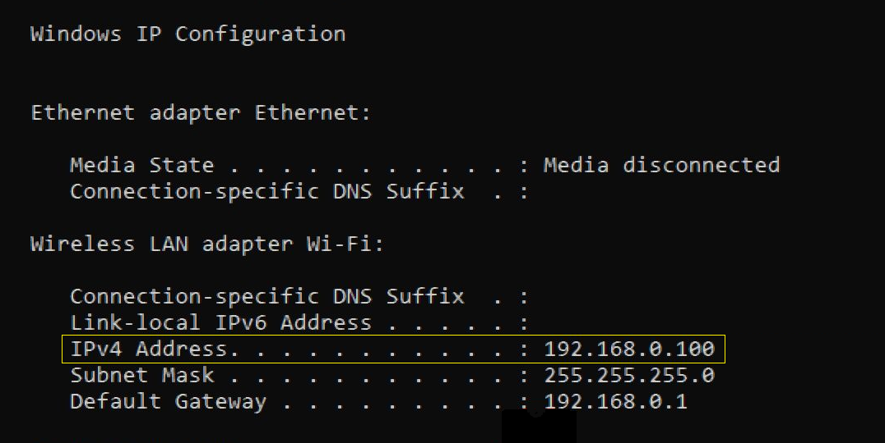

In this article, we will see how to easily **have access to your localhost from phone**, effortlessly. It can be really interesting for you to preview your app on phone in order to see the **responsive** part for example, especially if your main users are on phone.   
> Note that this method only works if the local machine and the phone are **connected to the same wifi**.   


* TOC
{:toc}

# 1. Get your machine IP address
If you are using **windows OS**, open up a terminal and type down this command :
```
ipconfig
```

It will show something like the image down below. You have to copy the IPv4 Address of your wifi :



# 2. Serve your local machine
## For a jekyll app
**Github pages** (and **gitlab pages**) use [Jekyll](https://jekyllrb.com/){:target="_blank"} to serve statically files. Even this actual blog is using Jekyll.   
Let's assume that, on your local machine :
- you already have a folder with the static files (html, js, css)
- you already have jekyll installed 

All you need to do is open up a cmd and serve it locally, by replacing the `192.168.XX.XX` with the one you noted [in step 1](#1-get-your-machine-ip-address) :
```
jekyll serve --i -H 192.168.XX.XX -P 8080
```

If you want livereload activated, you can also serve it this way :
```
bundle exec jekyll serve --i --livereload --trace -H 192.168.XX.XX -P 8080
```


## For a react app
I will also assume that you already have installed the react app on your local machine. If not, feel free to check the [dedicated article about it](/create-and-deploy-react-JS-app-for-free/#3-create-react-js-app-and-change-gitignore-and-packagejson-files){:target="_blank"}.

Let's add a new command in the scripts of your `package.json` file :
```
	...
	"scripts" : {
		...
		"startlocal": "react-scripts start --host 0.0.0.0"
		...
	}
	...
```
Your final file will look like this :


From now on, you will have to use **`npm run startlocal`** to launch the server, instead of using `npm run start` as you may used to.

# 3. Connect to the local network
Whether it's on your local machine or on your phone, just go to your browser and launch the URL down below. Of course, you still have to replace `192.168.XX.XX` with yours :
```
http://192.168.XX.XX:8080
```

And voilà !


