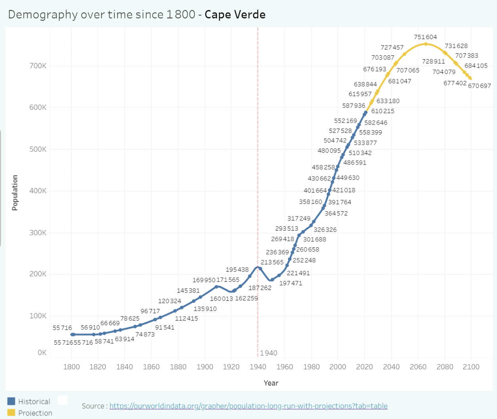

Have you ever wondered what are the **main events** of the countries of this world ? We might know about the world wars, pandemics, baby boom... But let's see how **demographic data** can also reflect the **history of each country** !

* TOC
{:toc}

# 1. Data source
_[Our world in data](https://ourworldindata.org/grapher/population-long-run-with-projections?tab=table){:target="blank"}_ produces frequently demographic data for each country / continent / areas of the world. 

This data source separates time in two parts :
- **Historical data**, until 2021
- **Projected data**, from 2022 until 2100

> To know more about how they gather this demographic data, feel free to [check out their documentation](https://ourworldindata.org/population-sources){:target="blank"}.

# 2. Data cleaning
When I downloaded the raw csv data, I noticed that the `country` field has few values that should be ignored, as I only want to preview **demographic data on countries level** :   

So for the rest of the article, the above territories are discarded.

# 3. Insights : 15 facts about some countries of this world
From now on, let's  see what kind of information we can retrieve from this demographic data.

## Ireland in 1840s
**[The Great Famine](https://en.wikipedia.org/wiki/Great_Famine_(Ireland)){:target="_blank"}**, caused by potato blight, led to mass starvation, disease, and emigration, reducing Ireland's population by about 25%.

## Hong Kong in 1940-1945
**[Japanese occupation](https://en.wikipedia.org/wiki/Japanese_occupation_of_Hong_Kong){:target="_blank"}** during World War II led to widespread suffering, food shortages, and significant civilian casualties until **Hong Kong liberation** in 1945.

## Cape Verde in 1940's
**Severe famines**, exacerbated by colonial mismanagement, caused high mortality rates and forced many to **emigrate**. Check out **[Cape Verde history](https://en.wikipedia.org/wiki/Cape_Verde#History){:target="_blank"}** details directly from wikipedia.

## North Korea in 1950
The **[Korean War](https://en.wikipedia.org/wiki/Korean_War){:target="blank"}** resulted in widespread destruction, significant loss of life, and the division of Korea into North and South. 

## Cambodia in 1974
The Khmer Rouge regime led to the **[Cambodian genocide](https://en.wikipedia.org/wiki/Cambodian_genocide){:target="_blank"}**, killing an estimated 1.7 million people through starvation, forced labor, and executions.

## Lebanon in 1977
The **[Lebanese Civil War](https://en.wikipedia.org/wiki/Lebanese_Civil_War){:target="_blank"}** involved numerous factions, resulting in extensive casualties, displacement, and infrastructure damage. 

## Afghanistan in 1979-1989
The **[Soviet–Afghan War](https://en.wikipedia.org/wiki/Soviet%E2%80%93Afghan_War){:target="_blank"}** caused immense destruction, significant civilian casualties, and led to the rise of militant groups.

## Kuwait in 1990
The **[Gulf War](https://en.wikipedia.org/wiki/Gulf_War){:target="blank"}** involved Iraq's **[invasion of Kuwait](https://en.wikipedia.org/wiki/Gulf_War#Invasion_of_Kuwait){:target="_blank"}**, leading to a coalition-led liberation and extensive destruction.

## Armenia in 1991
The **[Nagorno-Karabakh Conflict](https://en.wikipedia.org/wiki/Nagorno-Karabakh_conflict){:target="_blank"}** led to a protracted war with Azerbaijan, causing many deaths and displacements.

## Bhutan in 1991
**[Ethnic cleansing campaigns targeted the Lhotshampa people](https://en.wikipedia.org/wiki/Bhutanese_refugees){:target="_blank"}**, resulting in mass expulsions and refugee crises.

## Rwanda in 1993
The **[genocide against the Tutsi](https://en.wikipedia.org/wiki/Rwandan_genocide){:target="_blank"}** led to the massacre of around 800,000 people within 100 days.

## Djibouti in 1993
The **[Djiboutian Civil war](https://en.wikipedia.org/wiki/Djiboutian_Civil_War){:target="_blank"}** caused significant strife, disrupting normal life and causing casualties and displacement. 

## Kosovo in 1997
The **[Kosovo War](https://en.wikipedia.org/wiki/Kosovo_War){:target="blank"}** resulted in ethnic conflict, NATO intervention, and significant displacement and casualties.

## Libya in 2011
The **[Libyan civil war](https://en.wikipedia.org/wiki/Libyan_Civil_War_(2011)){:target="blank"}**, part of the Arab Spring, resulted in the toppling of Muammar Gaddafi's regime and ongoing conflict.

## Syria in 2011
The **[Syrian Revolution](https://en.wikipedia.org/wiki/Syrian_Civil_War){:target="blank"}** escalated into a civil war, causing a humanitarian crisis with hundreds of thousands of deaths and millions displaced.

# 4. Explore the dataviz yourself
Wanna explore more ? Feel free to check out demography evolution (and projections) of your own country [from here](https://jadynekena.com/projets-donnees-ouvertes/?id=see-what-happened-in-your-country-history-this-year&src=84b58af7-5bd1-427b-92f5-a7b2ee9a7b6a){:target="_blank"} !
