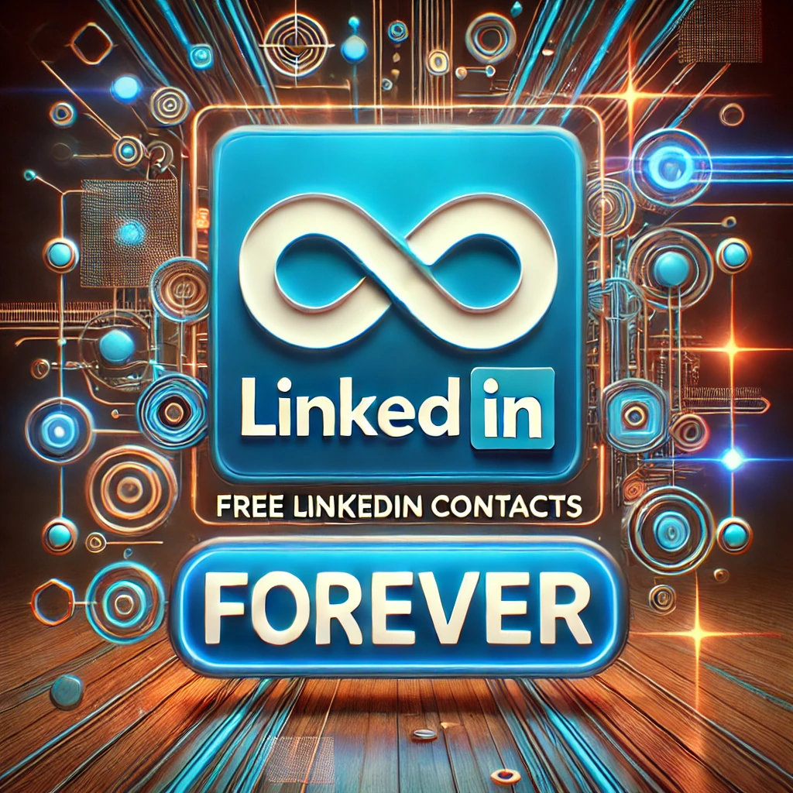
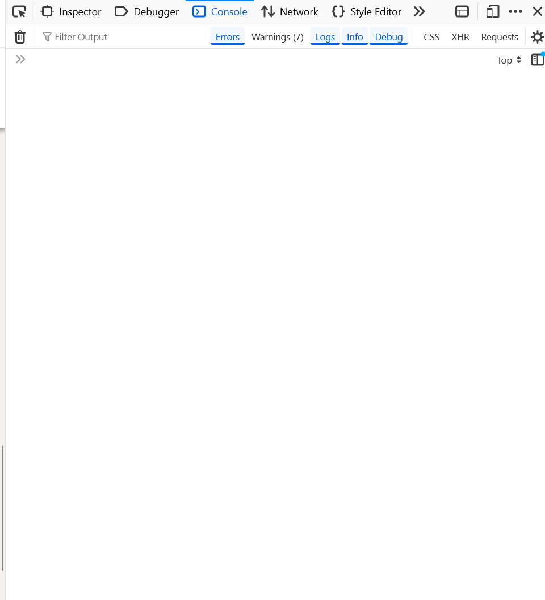

* TOC
{:toc}

You want to know which person you should contact first in a specific company, without any software just by using your **linkedin** account ? Well that's exactly the purpose of this article, with a **completely free and forever free solution**.



# Motivation
If you want to know the people that are working in a company, and which one of them is the right contact to you, know that this is exactly my same need.

# Before starting
Well, I assume that you are :
- connected to your linkedin account
- aware of which company you're interested in
- using a desktop browser (for this article, it will be Mozilla Firefox)

# The way to do it
Let's suppose you want to work at **supabase** (which must be so cool!). Any `supabase` keyword should by now be replaced with your company name on linkedin.

## Open linkedin company URL
Go first is at [https://www.linkedin.com/company/supabase/people/](https://www.linkedin.com/company/supabase/people/){:target="_blank"} and scroll down until the end of the page.   
There could be a `Show more` button at the bottom of the page, just click on it and keep scrolling down until the end.

> Note that this **scrolling step is really important to gather as maximum contacts as you can**.

## Open console terminal
Click on F12 or do CTRL+SHIFT+M. It will open your console on the right, like this:


## The code for the magic
Just **paste the following code in the open console**, and you will have a json downloaded right into your device storage.
```
jsonData = Array.from(document.querySelector('.scaffold-finite-scroll__content ul').querySelectorAll("li.grid")).map((e, i) => {
	return {
		url: e.querySelector("a[data-test-app-aware-link]") ? e.querySelector("a[data-test-app-aware-link]").href.split('?')[0] : null,
		name: e.querySelector(".artdeco-entity-lockup__title.ember-view").textContent.trim(),
		role:  e.querySelector(".artdeco-entity-lockup__subtitle.ember-view").textContent.trim(),
		photo: e.querySelector("img.evi-image.lazy-image.ember-view:not(.ghost-default)").src,
		rownumber: i+1,
		details: e.querySelector(".ember-view.lt-line-clamp.mt2").textContent.trim(),
		button: e.querySelector("button") ? e.querySelector("button").textContent.trim() : null
	}

});

blob = new Blob([JSON.stringify(jsonData, null, 2)], { type: "application/json" });
link = document.createElement("a");
link.href = URL.createObjectURL(blob);
link.download = "linkedin_data.json";
link.click();
URL.revokeObjectURL(link.href);
link.remove();

```

# Few explanations
- Scrolling will make all the data visible on the screen
- Mapping over the whole list will give you the details of each contact :
	- the linkedin profile URL (with no additional parameters) ;
	- the whole name, role and any public profile picture url
	- the row number (the smallest the closest to your network)
	- few details (like number of followers and common contacts)
	- button : whether it's `Follow` or `Connect`
- Creating a non-visible link and clicking on it with the code will force the JSON download

# Limits
- When it's a huge company like [Meta](https://www.linkedin.com/company/meta/people/){:target="_blank"}, you will struggle to get all the data because you will have to scroll over and over again. Moreover, I don't think our desktop is able to scroll over 150k+ elements (memory would explode).
- Some people chose to be unfound on linkedin, especially for those who are searching from a too far network. The person would appear with no button at all, no profile pic, no displayed name. It's because of [this setting](https://www.linkedin.com/help/linkedin/answer/a528138){:target="_blank"}.
- Now that you have data... it's now all about **how you use them** !


