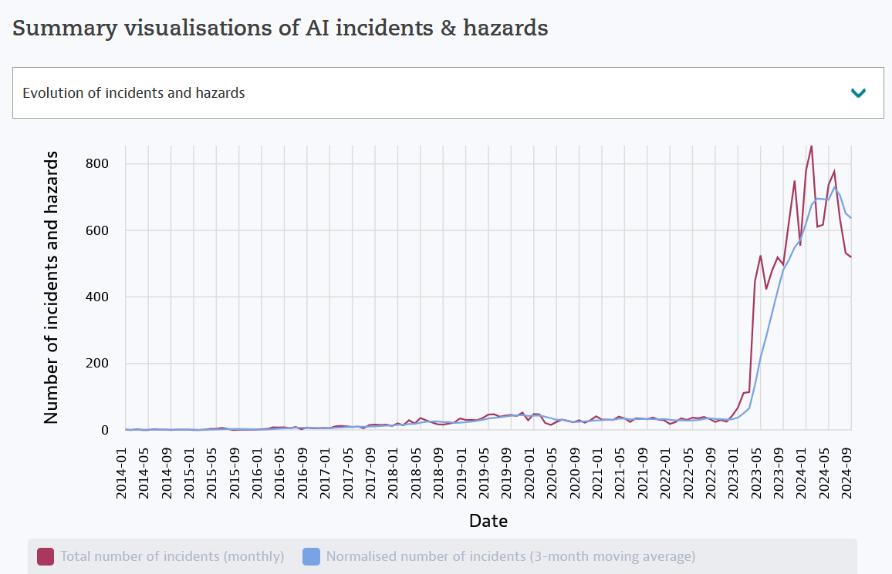

* TOC
{:toc}

Who never heard about AI in 2024 ? Why is it so trendy nowadays ? Why do some companies act like they knew about it for DECADES ?  As a **data professional**, I'm gonna say what I think about it (**and the title says it all**).


# Disclaimer
This article is going to be less technical than usual. The whole content here is a **very personal point of view** and I don't pretend to have the absolute knowledge. Since chatGPT has been publicly launched in November 2022, I noticed a **very disturbing way of how people talk about AI in general**. FYI, I will probably say "AI" for text-generator ones (in reference to chatGPT), but there is obviously more than that in this field. Let's dive into it.    
> You might ask yourself - and you are totally right to do so : who am I to be a relevant perspective ? Well, I've been **working as a Data Analyst for 6+ years now**, and before that, I have spent 6 years in an engineering school (IT and telecommunications), and I learned how Deep Learning works in 2019 (3 years before it begun to be so trendy). I spent **almost the half of my life dedicated to IT**. And don't get me wrong: **I do use AI frequently** (as long as it can help), but I don't agree with the current hype on it.

# How AI changed our daily lives

## 1. In Real Life
AI is indeniably **time-saving tool** for anyone who knows how to use it properly.

- AI can actually be really helpful to **learn about a new topic**, but in my opinion **it should never be the only source of information** you should use. In schools and even at universities, students are now **suspected** to be using AI for their homeworks (even when they are just brilliant). 
- To organize **vacation**, I can confirm you that AI is very powerful. It will give you the must-sees of your next destination, the itinerary from your hotel and the time it will take to go over there. TIME-SAVING, definitely. Be careful though : sometimes the details it gives are totally wrong, for example for the transportations it gave me for visiting Prague - lol.
- As a dev or a data professionnal, AI has redefined **our work**. Some people use it to solve a tiny problem they're facing (instead of using [StackOverflow](https://stackoverflow.com/){:target="_blank"} for example), and some other give the whole big problem to the AI directly. Personally, I'm still part of the first group of people.
- Recently, I have heard about a french church that released a AI **related to faith/the Bible**: [Hello Bible](https://www.hellobible.ai/fr){:target="_blank"}. Honestly, I really doubt on the "AI" behind it because when I talked to it about something else than the Bible, it kept saying the same thing over and over again. Also, I find it problematic to base your personal faith on a machine response... But who am I to judge !


## 2. On social media
### Standard social medias
The following platforms are those I call "standard" ones:
- **Twitter** (I will never call it X)
- **Facebook** 
- **Instagram**
- **TikTok**
- **Youtube**
In ALL of them, you will probably see contents created by AI (without necessarily knowing it): images, videos, texts, and even voice-overs.

But in middle of that, the most **deplorable** content generated by AI must be **the fake news spreading**. The bigger it is, the more people believe in it and click. People do that to convince to their opinion, to culturally cancel someone (this is LAME), to have online visibility, etc. No matter the reason behind, for me it is **always** a wrong one.

Another intersting fact about those platforms: they intentionally collect users' data to train their own AI models. Yes, every single activity that you might have online is safely stored on purpose.
> Check out the section about the [AI training here](#training-models-with-input-data). 


### Linkedin
- People create **linkedin posts** using AI. They even sell the prompts that made them have the "perfect post for linkedin". (yeah)
- A lot of companies have magically changed their **core activity** into AI-centered one. Or maybe the linkedin algorithm made them more visible on the platform, I don't know honestly.
- People keep talking about AI because it's a **buzzword**. A magical black box that interests every single person.

## 3. In job offers
I have seen so many problematic job offers (ofc not all of them), that might have one or more of the following statements:
- Statistical skills become **neglected** compared to AI
- **Technical buzz-words** are over-used for a very **simple task description**
- **Machine-oriented skills** first, soft-skills maybe later

## 4. Google searches
According to [google trends data](https://trends.google.com/trends/explore?date=all&q=ai&hl=en){:target="_blank"}, AI has taken over google searches especially in late 2022. Interest kept being high since then.


# How actually AI works in simple words
First of all, **AI is not as intelligent as you may think**. It cannot think. It cannot solve problems itself. It just adapts itself into what humans are expecting it to do. It takes inputs and parameters (pure mathematical things), **trains** itself with that and **use** its "knowledge" to adapt to new situations. A trained AI is called a "**model**".

Here are few examples of final situations an AI can process :
- **Content generation** : images, videos (like deepfakes), texts, voices, etc
- **Classification** : a mail is a spam or not, a handwriting is from this person or not, a photo is a cat or a dog or another animal, an X-rays image shows up a cancer or not, etc
- **Prediction** : based on sales we know from the past 10 years, we can predict at 90% accuracy that next month we will make XXX$ of sales
- **Natural language processing** : like chatGPT, it makes you feel like it understands the meaning of your words, and can have a conversation with you

etc.

# What AI is NOT (please read this)
- **Conditional statements** (```if ... then ... else ...```)
- An **automated** and **repetitive task**
- A **decision maker**
- A **dashboard**

... and the list goes on !

# Limits that AI may have
- The **less data**, the **less relevant** results
- **Wrong** training, **wrong** results
- Examples of **failing results** of AI
	- chatGPT created fake website results on a specific topic (here is [an example I witnessed](https://chatgpt.com/share/67104613-d6c8-800d-8e10-b186d083e873){:target="_blank"}, in french) 
	- [McDonalds ordering disaster](https://oecd.ai/en/incidents/91533){:target="_blank"}
	- [NYC’s AI Chatbot tells businesses to break the law](https://themarkup.org/news/2024/03/29/nycs-ai-chatbot-tells-businesses-to-break-the-law){:target="_blank"}
	- [Healthcare algorithm failed to flag Black patients](https://www.scientificamerican.com/article/racial-bias-found-in-a-major-health-care-risk-algorithm/){:target="_blank"} (yeah how inconvenient)

According to [OECD](https://oecd.ai/en/incidents?search_terms=%5B%5D&and_condition=false&from_date=2014-01-01&to_date=2024-10-16&properties_config=%7B%22principles%22:%5B%5D,%22industries%22:%5B%5D,%22harm_types%22:%5B%5D,%22harm_levels%22:%5B%5D,%22harmed_entities%22:%5B%5D%7D&only_threats=false&order_by=date&num_results=20){:target="_blank"}, there is so much reported AI incidents, more than ever :


# What cringes me the most
- AI should be a helper, and **humans should ALWAYS be the one with the intelligence**. Society tends to make it the other way round, and it disturbs me.
- People in the workforce are **making too much**. When I randomly scroll on linkedin, there is always this person who pretends to know everything about AI. **They solve ALL problems with AI, even the trivial ones**. They master the AI (while it doesn't always need supervision...).

To sum up, I'm really tired of this overwhelming online hype. Yes, AI helps. Yes, AI is time-saving. Yes, AI is really cool. **But people are making AI a big deal**.

Please, if you read until this line : **don't use AI for every single problem that you face**. **Your brain also has intelligence**.

